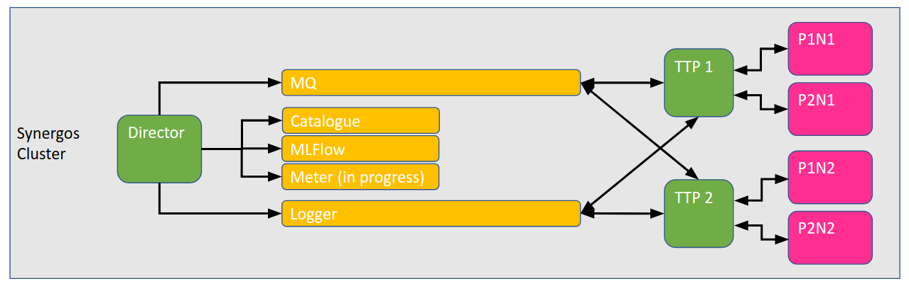

# Synergos Director

Main job orchestrator for a synergos cluster.

*Setting up Synergos Cluster for complex workloads*

Synergos Director is one of the core components necessary to scale up your Synergos workflow!

In addition to having all functions as that of [Synergos TTP](https://github.com/aimakerspace/synergos_ttp), it serves to ease the process of parallelizing multiple jobs across multiple federated grids.

---

## Installation

Synergos Director has been dockerized for easy component-based deployment. 

```
# Download source repository
git clone https://github.com/aimakerspace/synergos_director
cd ./synergos_director

# Initialize & update all submodules
git submodule update --init --recursive
git submodule update --recursive --remote

# Build director image
docker build -t synergos_director:syncluster --label "syncluster_director" 

# Start containerized service
docker run --rm 
    -p <PORT>:5000      
    -v <PATH-TO-DATA>:/orchestrator/data        # <-- Mount for data access
    -v <PATH-TO-OUTPUTS>:/orchestrator/outputs  # <-- Mount for outputs access
    -v <PATH-TO-MLFLOGS>:/mlflow                # <-- Mount for MLFlow outputs
    --name director_syncluster 
    synergos_director:syncluster          
        --id director_syncluster        
        --logging_variant <LOGGER-VARIANT> <LOGGER-HOST> <SYSMETRIC-PORT> 
        --queue <MQ-VARIANT> <MQ-HOST> <MQ-PORT>
        --censored                              # <-- optional
        --debug                                 # <-- optional
```

- `<PORT>` - Port on which Synergos Director is served
- `<PATH-TO-DATA>` - User's custom volume on which data is to be stored 
- `<PATH-TO-OUTPUTS>` - User's custom volume on which outputs are to be stored
- `<PATH-TO-MLFLOGS>` - User's custom volume on which MLFlow logs are to be stored
- `<LOGGER-VARIANT>` - Logger backend deployed (i.e. `"graylog"` or `"basic"`)
    - `<LOGGER-HOST>` - If Synergos Logger was deployed, specify logger's host
    - `<SYSMETRIC-PORT>` - If Synergos Logger was deployed, specify logger's allocated sysmetric port. A sysmetric port is the port allocated for logging system resource usage for any synergos component within the same deployment setting/grid.
- `<MQ-VARIANT>` - Message queue backend deployed (only `"rabbitmq"` accepted for now)
    - `<MQ-HOST>` - Specify Synergos MQ's host. This is a mandatory declaration, since Synergos Director orchestratrates jobs across multiple grids.
    - `<MQ-PORT>` - Synergos MQ's allocated port

An example of a launch command is as follows:

```
docker run --rm 
    -p 5001:5000      
    -v /synergos_demos/orchestrator/data/:/director/data      
    -v /synergos_demos/orchestrator/outputs/:/director/outputs      
    -v /synergos_demos/orchestrator/mlflow/:/mlflow 
    --name director_syncluster 
    synergos_director:syncluster          
        --id director_syncluster        
        --logging_variant graylog 172.30.0.4 9300 
        --queue rabbitmq 172.17.0.4 5672
```